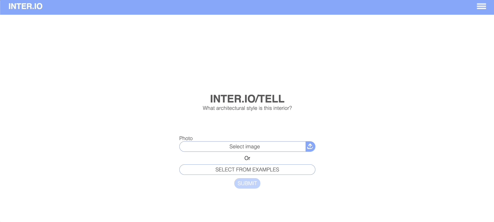
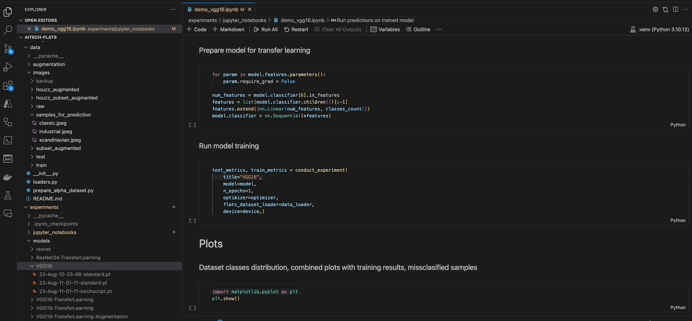
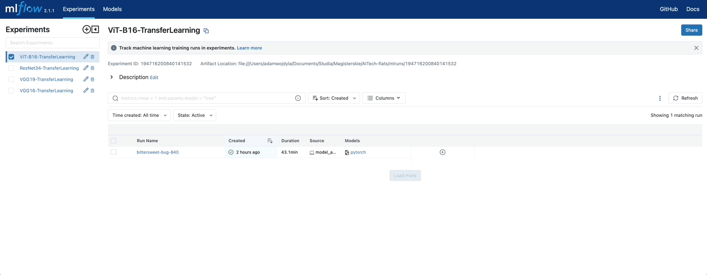
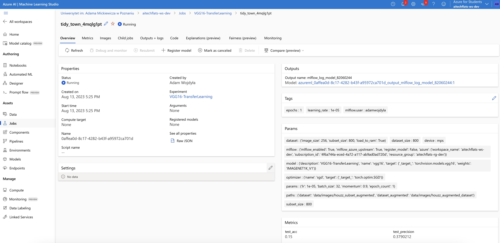
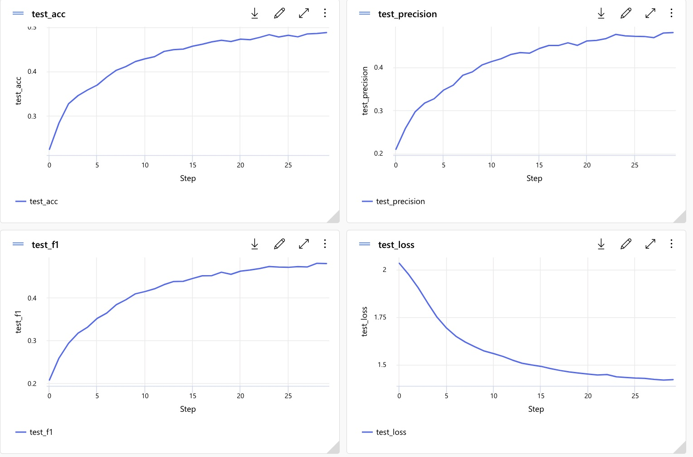

<!--
SPDX-FileCopyrightText: 2023 Adam Wojdyła <adam.wojdyla@outlook.com>

SPDX-License-Identifier: MIT
-->

# AITech-flats

## Project Description

AITech MSc project - 'Classification of Interior Architectural Styles using Deep Learning'. This research and development project aims to use deep learning algorithms to automatically classify interior architectural styles based on their visual features and design elements.

## Table of Contents

- [AITech-flats](#aitech-flats)
  - [Project Description](#project-description)
  - [Demo](#demo)
    - [Web app with integrated ML model for image style prediction](#web-app-with-integrated-ml-model-for-image-style-prediction)
    - [Raw model predictions on sample image](#raw-model-predictions-on-sample-image)
  - [Setup](#setup)
    - [Prerequisites](#prerequisites)
    - [Installation steps](#installation-steps)
  - [Usage](#usage)
    - [Dataset](#dataset)
      - [Images structure](#images-structure)
    - [Jupyter Notebook](#jupyter-notebook)
    - [Terminal](#terminal)
      - [VGG16 model](#vgg16-model)
      - [VGG19 model](#vgg19-model)
      - [ResNet34 model](#resnet34-model)
      - [ViT_B16 model](#vit_b16-model)
      - [VGG16 model with custom hyperparams](#vgg16-model-with-custom-hyperparams)
      - [VGG16 model with subset of 1600 images and augmentation](#vgg16-model-with-subset-of-1600-images-and-augmentation)
    - [Inference Function](#inference-function)
    - [MlFlow](#mlflow)
      - [Local](#local)
      - [AzureML](#azureml)
    - [Frontend Web Application](#frontend-web-application)
  - [Research Project](#research-project)
    - [Results](#results)
      - [Baseline model](#baseline-model)
      - [Baseline results](#baseline-results)
    - [Poster](#poster)
    - [Awards and Recognition](#awards-and-recognition)
    - [Funding](#funding)
    - [Contact Information](#contact-information)
  - [License](#license)

## Demo

### Web app with integrated ML model for image style prediction

Example presents a simple frontend web app which was deployed to Azure and was available to users under public URL. Web app calls the inference function with ML model that was developed during the project. The model returns predictions for 8 interior style classes, web app displays 5 interior styles with top prediction. User can pick a photo form the sample images or upload own file.



### Raw model predictions on sample image

A simple example showing the use of a trained ML model for interior style prediction.



## Setup

Here are the inslation instructions for the research part of the project (data preparation, model training and evaluation). There are two other sub-projects related to image scrapping and function for inference.

Each project contains own instructions:

- ImageScrapper [README](./ImageScrapper/README.md)
- InferenceFunctionApp [README](./InferenceFunctionApp/README.md)

### Prerequisites

- Python 3.10
- pip (package installer for Python)
- virtual environment
- Jupyter Notebooks  

Additional prerequisites for Azure part (MLFlow on AzureML, Azure Web App, Azure Function App):

- An Azure account with an active subscription. [Create an account here](https://azure.microsoft.com/en-gb/free/machine-learning/).
- Active workspace in Azure Machine Leatning Studio. [How to create workspace](<https://learn.microsoft.com/en-us/azure/machine-learning/quickstart-create-resources?view=azureml-api-2>)

### Installation steps

1. Clone the repository

    ```sh
    git clone <https://github.com/emkarcinos/AITech-flats.git>
    ```

2. Create and activate virtual environment

    ```sh
    python3 -m venv .venv
    source .venv/bin/activate
    ```

3. Install requirements from file [requirements.txt](./requirements.txt)

    ```sh
    pip install -r requirements.txt
    ```

## Usage

Before starting the project, ensure that the configuration values are set properly. Feel free to modify the configuration stored in the [config.yaml](./config/config.yaml) file to run custom training. More information on supported config params below.  

*Note: this doesn't apply to the jupyter notebook which has the paths hardcoded*

<details>
  <summary>Click to show config detailed description</summary>

**defaults Section** - Specifies the default values for the model and optimizer parameters. If these parameters are not specified in the command line or in the overrides section, the default values will be used.

- `model` - The model architecture used in experiment. Supported values are: vgg16, vgg19, resnet34, vitb16.
- `optimizer` - The optimize function used in experiment. Supported values are: sgd, adam.

New models and oprimizers can be added by creating appropriate .yaml file and updating the [model_utlis.py](./internal_modules/utils/model_utlis.py) file.

**hydra Section** - Specifies the configuration for the Hydra framework, which is used to manage the configuration parameters. Bascically, the current configuration prevents from creating new directories and files by the package.

**params Section** - Specifies the values for the hyperparameters used in the script. These values can be overridden in the command line or in the overrides section.

- `lr` - Learning rate for the optimizer.
- `batch_size` - Batch size for training and validation.
- `momentum` - Momentum for the optimizer (only applicable for SGD).
- `epoch_count` - Number of epochs to train the model.

**mlflow Section** - Specifies the configuration for the MLflow framework, which is used to track the experiments and metrics.

- `mlflow_enabled` - specifies whether MLflow is enabled or not. If set to True, the script will log the metrics to MLflow
- `mlflow_azure_upstream` - specifies whether the metrics should be logged to an Azure ML workspace. If set to True, the metrics will be logged to the Azure ML workspace.
- `register_model` - specifies whether the trained model should be registered in MLflow to enable versioning.
- `azure`
  - `workspace_name` - Name of the workspace in AzureML.
  - `subscription_id` - The ID of Azure subscription.
  - `resource_group`: Name of the resource group with ML workspace.

**dataset Section** - specifies the configuration for the dataset used in the script.

- `subset_size` -  specifies the number of images to use from the dataset. If set to None, full dataset is used in training.
- `load_to_ram` - specifies whether the dataset should be loaded into memory or not.

**paths Section** - specifies the file paths used in the script.

- `dataset` - Directory where the dataset is located.
- `dataset_augmented` - Directory where the augmented dataset will be located.

</details>

### Dataset

Raw image files are not kept in the repository. The raw data should be placed in the `images/raw` directory, and then the config `paths.dataset` should be updated. When running the experiment, the script in the `loaders.py` file will perform a transofmation of the images and also split the dataset into a test and validation set.

Currently there are 3 sources of data supported:

- Houzz (auto labeled)
- Pinterest (auto labeled)
- Olx (manualy labeled)

The repository contain sample Houzz dataset (800 images) which enables the project to be launched and tested. In order to fully reproduce the results, the owners of the repository must be contacted to provide the full dataset. In the case of Houzz dataset, this is approximately 11000 images (1.5GB of data).

You can add your own dataset and train the model on your custom data, just remember to follow the same structure as in the sample dataset.

#### Images structure

```
AITech-flats
│   README.md
└───images
    └───raw
        └───scandinavian 
        │      1.jpg
        │      2.jpg
        │      ...
        └───yourcustomstyle2
        │      1.jpg
        │      2.jpg
        │      ...
        └───yourcustomstyle3
               1.jpg
               2.jpg
               ...
```

### Jupyter Notebook

The step by step demo is in [demo_vgg16.ipynb](./experiments/jupyter_notebooks/demo_vgg16.ipynb) file.

### Terminal

The [run_experiment.py](./experiments/python_scripts/run_experiment.py) is a generic script that allows various experiments to be performed based on the configuration values entered. The configuration can be changed in a file or directly in the terminal when calling a command.

#### VGG16 model

  ```sh
 python ./experiments/python_scripts/run_experiment.py model=vgg16 optimizer=sgd 
 ```

#### VGG19 model

  ```sh
 python ./experiments/python_scripts/run_experiment.py model=vgg19 optimizer=sgd 
 ```

#### ResNet34 model

  ```sh
 python ./experiments/python_scripts/run_experiment.py model=resnet34 optimizer=adam
 ```

#### ViT_B16 model

  ```sh
 python ./experiments/python_scripts/run_experiment.py model=vitb16 optimizer=sgd 
 ```

#### VGG16 model with custom hyperparams

  ```sh
 python ./experiments/python_scripts/run_experiment.py model=vgg16 optimizer=sgd params.lr=0.0005 params.epoch_count=5
 ```

Running the scripts should display the configuration used, load the data and begin the process of training the model. When training is finished, the location with saved model will be displayed as well.


#### VGG16 model with subset of 1600 images and augmentation

  ```sh
 python ./experiments/python_scripts/run_experiment.py model=vgg16 optimizer=sgd dataset.subset_size=1600 augmentation=basicaugmentation paths.dataset_augmented=data/images/my_augmented_dataset
 ```

When augmentation is set, the script will create a new folder specified in the `paths.dataset_augmented` config and create additional augmented images in this folder. When `dataset.subset_size` is provided, the new floder will have subset_size*2 images (raw images + augmented images).


### Inference Function

Before you run the inference function you need to convert the model to `onnx` format. The model should be saved in torchscript format.

```sh
python ./experiments/python_scripts/convert_to_onnx.py -s {source_path} -d {dest_path}
```

*Note: The destination .onnx model path must be like this: InferenceFunctionApp/score/models/classificationModel.onnx. Its required for the inference function to load the model properly.*

1. Go to Inference project

    ```bash
    cd InferenceFunctionApp
    ```

2. Follow install requirements in the [README](./InferenceFunctionApp/README.md) file

3. Start the function from terminal (or run with VSC debugger, more info on configuration [README](./InferenceFunctionApp/README.md))

    ```bash
    func start
    ```

4. Function should start on localhost:7071
  
5. Import postman [collection](../Postman/AITech-flats.postman_collection.json) and try out the API. The input image should be in base64 format. The result will be a json object with predictions of interior styles for image passed in request
  

### MlFlow

#### Local

In order to save the experiment information and model evaluation metrics to MLFlow, the use of MLFlow must be enabled using the configuration.

```sh
python ./experiments/python_scripts/run_experiment.py model=vgg16 optimizer=sgd mlflow.mlflow_enabled=True
```

Then we need to start the MLFlow UI.

```sh
mlflow ui
```

This should start the server on localhost. After visiting the address <http://127.0.0.1:5000>. When you visit the address, a site should load that allows you to preview the experiments performed, the metrics and the artifacts generated.


#### AzureML

In order to save the experiment information and model evaluation metrics to MLFlow on azure first log in to azure.

```sh
az login
```

Then set the `mlflow.mlflow_enabled` and `mlflow.mlflow_azure_upstream` params to True and run the experiment.

```sh
python ./experiments/python_scripts/run_experiment.py model=vgg16 optimizer=sgd mlflow.mlflow_enabled=True mlflow.mlflow_azure_upstream=True
```

The experiment should be logged in AzureML workspace.


### Frontend Web Application

TODO

## Research Project

### Results

#### Baseline model

In our baseline model, we used a convolutional neural network with the VGG19 archiecture with hyperparameters from the config.yaml file. The model takes an image in matrix format and generates predictions for 8 classification labels. We chose this model because it has a relatively simple architecture and is a good starting point for more complex models.

Its more than welcome to improve the performance of our model by community. One way to do this is by training your own models with different configurations, custom augmentations or differnet dataset. This can help to improve the accuracy and robustness of the model on different datasets and in different scenarios. The baseline model is available in folder `/experiments/models/VGG19-TransferLearning`

#### Baseline results

| Model              | Accuracy | Precision | Recall | F1-Score | Loss      |
|--------------------|----------|-----------|--------|----------|-----------|
| VGG16              | 0.4877   | 0.4857    | 0.4877 | 0.4863   | 1.4381    |
| VGG19 (Baseline)   | 0.4877   | 0.4799    | 0.4877 | 0.4798   | 1.4217    |
| ResNet34           | TBA      | TBA       | TBA    | TBA      |           |

Below are the test metrics from training VGG19 baseline model


### Poster

As part of the research and development project we prepared a Poster describing the trained model and research results. Poster can be found here: [Poster](./ProjectFiles/interio_PPRAI_Poster.pdf)


### Awards and Recognition

Our project's poster was accepted at the Polish Conference on Artificial Intelligence (PP-RAI). The conference provides a platform for researchers and practitioners to exchange ideas and advancements in the field of AI. We are excited that our team had a chance to present the research results to broader public. [Read more](<https://pp-rai.pl/programme/cv-poster-session-papers/>)

Conference Details:

- **Event:** Polish Conference on Artificial Intelligence (PP-RAI)
- **Date:** 24.04.2023-26.04.2023
- **Location:** Łódź, Poland
- **Poster Title:** Classification of interior architectural styles using deep neural networks

### Funding

- The project was the winner of the 5th edition of the Study@research contest and received funding of PLN 10 000. The grant made it possible to finance, among other things, the payment of consultations with an interior design expert, the purchase of study meterials, participation in specialised training courses and remuneration for the research effort. [Read more](https://amu.edu.pl/studenci/programy-studenckie/study@research/aktualnosci/konkurs-049-study@research-rozstrzygniety)
- Project co-funded by the European Union under the European Regional Development Fund Digital Poland Operational Programme 2014-2020, Priority axis No. 3 "Digital competences of society" Measure No. 3.2 "Innovative solutions for digital activation" Project title: "Academy of Innovative Applications of Digital Technologies (AI Tech)". Agreement no. POPC.03.02.00-00-0001/20-00

### Contact Information

- Adam Wojdyła - <adam.wojdyla@outlook.com>
- Marcin Kostrzewski - <komar86311@gmail.com>
- Michał Ulaniuk - TO BE UPDATED

## License

Each file has a description with license. All licenses used in the project are located in `LICENSES` folder.
